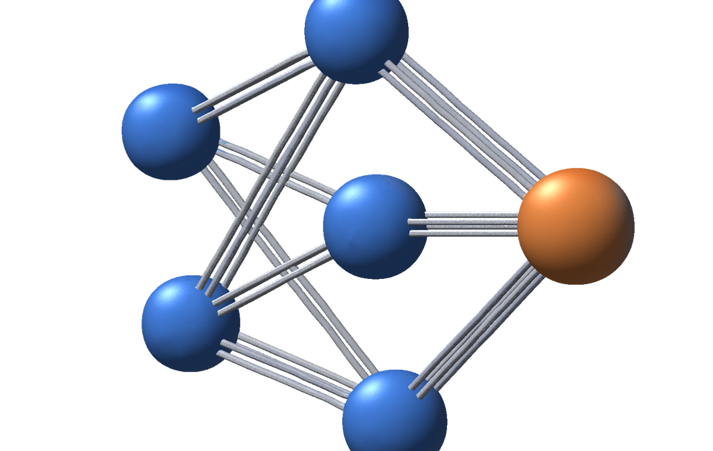

# NeuralViz



## 프로젝트 개요

브라우저에서 실시간으로 다층 퍼셉트론이 학습하는 과정을 시각적으로 확인할 수 있는 교육용 툴입니다.
**외부 라이브러리를 하나도 쓰지 않았습니다.**
행렬 연산, 역전파, 3D 원근 투영, 램버트 조명, 은면 처리까지 전부 구현하였으며, Canvas 2D를 활용하였습니다.
결정 경계, 망 구조, 손실 곡선, 손실 표면 4가지 시각화가 전부 같은 학습 루프를 공유합니다.

## 실행 방법

ES 모듈은 `file://` 에서 CORS로 막히므로 정적 서버가 필요합니다.

```bash
python -m http.server 8123
```

그 다음 브라우저에서 `http://localhost:8123/` 를 실행합니다.

## 구현한 수식 — 학습

행렬은 `(특징 × 샘플)` 배치로, 열 하나가 표본 하나입니다.

```
순전파   z[l] = W[l]·a[l-1] + b[l],   a[l] = f(z[l])
손실     J = -(1/m) Σ [ y·log(a) + (1-y)·log(1-a) ]      a는 [1e-12, 1-1e-12]로 클리핑
역전파   δ[L] = a[L] - y
         δ[l] = (W[l+1]ᵀ·δ[l+1]) ⊙ f'(z[l])
         dW[l] = (1/m)·δ[l]·a[l-1]ᵀ,   db[l] = (1/m)·Σ δ[l]
갱신     W[l] ← W[l] - η·dW[l]
```

출력층 델타가 `a - y` 로 단순해지는 이유: BCE의 `∂J/∂a = (a-y) / (a(1-a))` 와 시그모이드의
`σ'(z) = a(1-a)` 가 연쇄법칙에서 곱해지면서 분모가 그대로 상쇄되기 때문입니다.

## 구현한 수식 — 3D

```
회전   Ry = [[cosθ, 0, sinθ], [0, 1, 0], [-sinθ, 0, cosθ]]
       Rx = [[1, 0, 0], [0, cosφ, -sinφ], [0, sinφ, cosφ]]
       Rx(pitch) → Ry(yaw) 순으로 합성한 뒤 점마다 한 번만 적용
투영   z' = z + d,   s = f / z',   화면좌표 = (x·s, -y·s)      f = 900, d = 3.2
법선   인접 두 모서리의 외적을 정규화
조명   I = 0.35 + 0.65 · max(0, n·l)                          (램버트)
은면   z-버퍼 없이 셀 4꼭짓점 평균 깊이 내림차순 정렬          (화가 알고리즘)
```

**화가 알고리즘이 z-버퍼 없이도 안전한 이유**: 이 표면은 격자 위의 높이장(height field)을
위에서 내려다보는 형상이라, 셀끼리 A가 B를 가리면서 동시에 B가 A를 가리는 순환 겹침이
생길 수 없습니다. 그래서 셀 하나당 대푯값(평균 깊이) 하나로 전순서를 만들 수 있습니다.
오버행이 있는 형상으로 확장하면 이 전제가 깨지므로 z-버퍼나 셀 분할이 필요해집니다.

## 그래디언트 체킹

### 왜 필요한가

역전파는 **틀려도 손실이 그럭저럭 줄어듭니다.** 부호가 맞고 크기만 어긋난 기울기는 여전히
내리막 방향을 가리키므로, 학습 곡선이 내려가는 것만 보고는 버그를 잡을 수 없습니다.
눈으로 보이는 증상이 없는 종류의 오류라서, 미분을 독립적인 방법으로 한 번 더 구해 대조해야 합니다.

### 어떻게

각 파라미터 θᵢ를 ε만큼 양옆으로 흔들어 중심차분으로 수치 기울기를 구하고, 역전파가 낸
해석적 기울기와 벡터 단위로 비교합니다.

```
수치 기울기   (J(θᵢ+ε) - J(θᵢ-ε)) / (2ε)
상대오차      ‖a - n‖ / (‖a‖ + ‖n‖)        기준: 1e-7 미만이면 통과
```

### 실측값

| 은닉 활성화 | 상대오차 |
|---|---|
| tanh | 9.625e-10 |
| relu | 2.790e-10 |
| sigmoid | 1.744e-10 |

데이터 4종 × 활성화 3종 × 층구성 7가지 = **84조합을 3회 반복(252건)** 과 학습을 진행한 뒤의 4건까지,
**실패 0건, 최대 상대오차 1.2e-8** 입니다.

### ReLU 꺾임 문제 (1) — 원인 규명

처음에는 ReLU만 상대오차 2e-2로 실패했습니다. 원인은 역전파가 아니라 **수치 미분 쪽**이었습니다.

ReLU는 `z = 0` 에서 미분이 불가능합니다. 그런데 편향을 0으로 초기화하면 죽은 유닛
(앞 층 출력이 전부 0인 유닛)의 z가 **정확히 0** 이 됩니다. 이 지점에서 중심차분은 꺾임을
가로질러 좌미분 0과 우미분 1을 평균내므로, 수치 기울기 자체가 그 방향의 도함수와 무관한 값이 됩니다.

이것이 구현 버그가 아니라는 것은 대조 실험으로 확정했습니다. 시드 30개를 훑었을 때
**`min|z| = 0` 인 17건은 전부 실패했고, `min|z| > 0` 인 13건은 전부 통과했습니다(예외 0건).**
꺾임 근접도 하나가 통과 여부를 완벽하게 예측했고, 꺾임에서 떨어진 지점만 골라 재면
상대오차는 1e-8~1e-10대로 떨어졌습니다.

### ReLU 꺾임 문제 (2) — 안전 판정 개선

그래서 "검사 지점이 꺾임에서 충분히 멀리 있는가"를 미리 판정하도록 했습니다.
처음 판정은 *파라미터를 ε 흔들면 다음 층의 z가 최대 `ε·max|a|` 만큼 움직인다* 만 보았는데,
이것이 너무 낙관적이었습니다. 앞 층에서 생긴 교란은 뒤 층으로 가면서 **가중치만큼 증폭**됩니다.
그래서 상한을 층마다 누적하도록 바꿨습니다.

```
R[l] = ‖W[l]‖∞ · R[l-1] + ε · max(|a[l-1]|, 1)
```

활성화 도함수의 절댓값이 1 이하(tanh·sigmoid·ReLU 모두 해당)라는 성질을 이용한 립시츠 상한입니다.
각 층에서 `min|z| > R[l]` 이면 어떤 파라미터를 흔들어도 꺾임을 넘지 않습니다.
이 판정으로 바꾸자 252건 중 남아 있던 **실패 2건(최대 상대오차 5.17e-4)이 사라졌습니다.**

### 원칙

**"실패하면 시드를 다시 뽑아 통과할 때까지 돌리는" 방식은 의도적으로 배제했습니다.**
그 방식은 진짜 역전파 버그가 있어도 어쩌다 통과하는 지점을 찾아내 검증 자체를 무력화합니다.
대신 *측정이 유효한 지점인지를 사전에 판정하고*, 유효하지 않으면 유효한 지점을 찾아
그 사실을 화면에 명시하는 쪽을 택했습니다. 판정과 결과를 분리해 두면, 통과는 통과대로 믿을 수 있고
꺾임에 걸렸다는 사실도 숨겨지지 않습니다.

## 손실 표면의 한계

이 표면은 **선택한 두 파라미터만 움직이고 나머지는 현재 값에 고정한 2차원 단면**입니다.
실제 학습에서는 나머지 파라미터도 함께 변하므로, 표면 위에 그린 경로는 근사입니다.
학습이 끝나 파라미터가 거의 멈춘 뒤 그 지점에서 계산한 표면일수록 이 오차가 작습니다.

> 각주: 격자를 40등분하면 중심(현재 θ)이 격자 노드에 정확히 걸리지 않으므로, 표본 최저값이
> 현재 손실보다 근소하게 높게 나올 수 있습니다. (실측: 현재 손실 0.6849, 표본 최저 0.6852)

## 검증 방법론

이 프로젝트는 "보인다"가 아니라 **"쟀다"** 로 검증했습니다. 네 가지 예입니다.

- **리팩터링 동일성** — PRNG를 `random.js` 로 분리한 전후의 실행 출력을 바이트 단위로 `diff`
- **뉴런 겹침** — 캔버스 알파 채널을 스캔해 원의 지름과 간격을 픽셀로 측정
  (`[2,8,8,1]` 이 280px 안에서 지름 26px, 최소 간격 3px)
- **화가 알고리즘** — yaw 36종 × 31,408픽셀에서 화가 알고리즘의 결과와 무게중심 보간으로 구한
  실제 최근접 셀을 비교, 깊이 역전 0건
- **회전행렬** — `‖Rv‖ = ‖v‖` 오차 8.88e-16, `R(θ)R(-θ) = I` 오차 2.22e-16

## 파일별 역할

| 파일 | 역할 |
|---|---|
| `src/matrix.js` | `number[][]` 행렬 연산. 차원이 안 맞으면 형태를 찍어 throw |
| `src/activations.js` | tanh / ReLU / sigmoid의 `{ fn, derivative, initScale }` |
| `src/network.js` | MLP 본체 — 순전파, BCE 손실, 역전파, 갱신, 파라미터 직렬화 |
| `src/data.js` | XOR·원형·나선·가우시안 데이터 생성 |
| `src/random.js` | 시드 고정 난수(mulberry32)와 Box–Muller 정규분포 |
| `src/gradcheck.js` | 중심차분 수치 미분과 해석적 기울기의 상대오차 비교 |
| `src/proj3d.js` | 3D 회전·원근 투영·법선·램버트 음영. 순수 함수만 |
| `src/viz-boundary.js` | 결정 경계 히트맵 — 격자 3600점을 순전파 한 번으로 계산 |
| `src/viz-network.js` | 망 구조 다이어그램 — 선 두께는 가중치 크기, 색은 부호, 원 채움은 편향 |
| `src/viz-loss.js` | 손실 곡선 — 폭보다 점이 많으면 균등 다운샘플링 |
| `src/viz-surface.js` | 손실 표면 계산과 3D 렌더 (화가 알고리즘) |
| `src/main.js` | 컨트롤·학습 루프·뷰 전환을 묶는 진입점 |

## 실험 관찰

### 1. 은닉층과 XOR

은닉층을 모두 제거하면 손실이 **0.6849** (= ln 2 ≈ 0.6931 부근)에 정체하고 정확도가 **49.5%** 에 머뭅니다.
선형 결정경계 하나로는 XOR을 가를 수 없기 때문입니다.

손실 표면도 같은 사실을 말합니다. 표면의 최저점이 **0.6852** 로 현재 손실과 사실상 같아
**내려갈 골짜기 자체가 없고**, 주변은 최대 1.0134까지 오르막뿐입니다. 3000 epoch 동안 경로가
움직인 거리는 탐색 창의 **7%**, 손실 감소는 **0.0052** 에 그칩니다.

같은 사실을 2D 결정 경계는 "직선 하나가 점들 사이에서 헤맨다"로, 3D 표면은 "평평한 접시라
굴러갈 곳이 없다"로 보여줍니다. 한쪽만 봐서는 "학습이 덜 됐나"로 오해하기 쉬운데,
표면을 함께 보면 **더 돌려도 소용없다**는 것이 분명해집니다.

### 2. 학습률과 발산

`lr 0.5` 에서는 손실이 매끄럽게 감소하지만, `lr 3.0` 으로 올리면 **0.3~0.8 사이를 오가는 톱니 진동**으로
바뀝니다. 골짜기를 따라 내려가는 대신 양쪽 벽을 번갈아 튕기는 상태입니다.

### 3. 활성화 함수별 수렴 속도

XOR 200개, `[2,4,4,1]`, lr 0.5, 2000 epoch, 시드 1~8의 중앙값입니다.

| 활성화 | 손실 < 0.1 도달 | 도달 epoch | 최종 손실 | 정확도 |
|---|---|---|---|---|
| tanh | 8/8회 | 226 | 0.0043 | 100% |
| ReLU | 7/8회 | **162** | 0.0105 | 100% |
| sigmoid | **0/8회** | — | 0.3040 | 87.0% |

ReLU가 가장 빠르지만 8회 중 1회는 2000 epoch 안에 못 내려갑니다(죽은 유닛).
sigmoid는 한 번도 기준에 도달하지 못했습니다 — 도함수의 최댓값이 0.25라서 층을 지날 때마다
기울기가 최대 1/4배로 줄고, 은닉층 두 개를 거치면 16분의 1 이하가 되기 때문입니다.

### 4. 나선의 용량 한계

`[6,6]` tanh, lr 0.5로 **5,370 epoch에서 94.5%** (손실 0.1444)에 도달합니다.
가장 오래 걸리는 데이터셋이라, 어느 부분이 먼저 정리되는지 반지름 구간을 나눠 재봤습니다.
(시드 1~5 평균 정확도 %)

| 반지름 구간 | 표본 수 | 500 | 1000 | 2000 | 3000 | 5000 epoch |
|---|---|---|---|---|---|---|
| 안쪽 r<0.33 | 68 | 72.6 | 72.6 | 61.5 | 64.1 | 78.8 |
| 중간 0.33~0.66 | 64 | 25.0 | 16.3 | 20.3 | 63.8 | 86.9 |
| 바깥 r>0.66 | 65 | 81.2 | 83.4 | 84.6 | 89.2 | 93.2 |

구간당 표본이 60여 개뿐이라 **점 하나가 약 1.5%p** 입니다. 몇 %p 차이는 읽지 마시고
20%대와 80%대처럼 자릿수가 다른 차이만 보세요.

**바깥쪽이 가장 먼저 정리되고(500 epoch에 이미 81%), 중간 띠가 가장 늦습니다**(2000 epoch까지 20%대).
아르키메데스 나선에서 두 갈래 사이의 간격 자체는 일정합니다. `r = aθ` 인 두 갈래가
π만큼 어긋나 있으면 같은 방향에서 두 갈래의 반지름 차이는 항상 `aπ` 입니다.
달라지는 것은 곡률입니다. 반지름이 작을수록 같은 간격을 유지하는 경계가 더 급하게
휘어야 하는데, 은닉 유닛 몇 개로 만들 수 있는 굴곡의 수는 한정되어 있습니다.
그래서 곡률이 완만한 바깥쪽이 먼저 정리되고, 안쪽으로 갈수록 늦어집니다.

중간 띠가 20%대에 머무는 구간은 단순히 못 맞히는 게 아니라 **반대로 맞히고 있다**는 뜻입니다.
바깥쪽 경계를 먼저 세우느라 중간 띠를 통째로 잘못된 쪽에 넘겨두었다가,
3000 epoch 무렵 굴곡이 하나 더 생기면서 뒤집힙니다.

### 5. 눈에 띄는 점 = 틀린 점

데이터 점은 라벨 색으로 채우고 흰 테두리를 두릅니다. 그래서 **정상적으로 분류된 점은 배경색에 묻혀
흰 테두리만 남고**, 잘못 분류된 점만 반대 색으로 도드라집니다. 의도한 부작용이지만
오분류를 세지 않고도 눈으로 짚을 수 있는 지표로 쓸 수 있습니다.

학습 전 배경이 균일한 흰색인 것도 정상입니다. Xavier 초기화로 가중치가 작으면 `z ≈ 0` 이라
시그모이드 출력이 전 구간에서 0.5에 붙고, 0.5는 팔레트의 흰색입니다.

## 프리셋

| # | 설정 | 결과 |
|---|---|---|
| (a) | XOR + `[4,4]` + tanh + lr 0.5 | 최종 손실 0.0025, 정확도 100% |
| (b) | 나선 + `[6,6]` + tanh + lr 0.5 | 5,370 epoch, 94.5%, 손실 0.1444 |
| (c) | 원형 + 은닉층 없음 + lr 0.5 | 실패 사례 — 0.6936 → 0.6855, 정확도 56.5% |
| (d) | 손실 표면: (a) 학습 후 `W0[0][0]` × `W0[0][1]`, span 3.0, 격자 40 | 손실 범위 0.0019~1.9017, 종료 지점은 하위 3.5%의 골짜기 바닥 |

## 3D 에셋 출처

`assets/hero.png` 와 `assets/icon.png` 는 Blender로 만든 3D 모델을 렌더한 이미지입니다.
README와 아이콘에만 쓰였고, **웹앱 자체에는 사용하지 않았습니다** — 앱이 그리는 3D는
전부 `src/proj3d.js` 와 `src/viz-surface.js` 가 Canvas 2D에 직접 계산해 그립니다.
